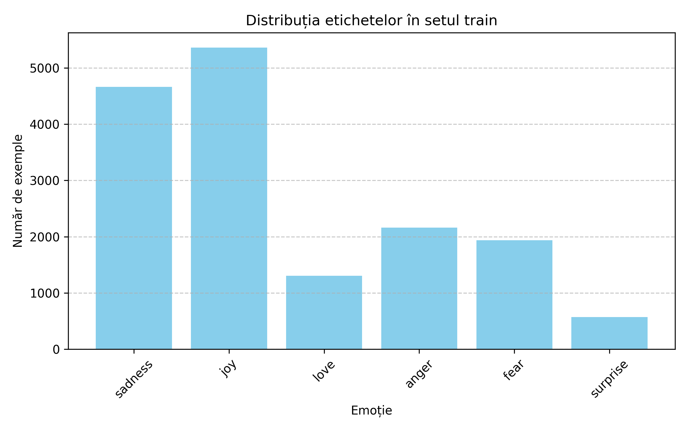
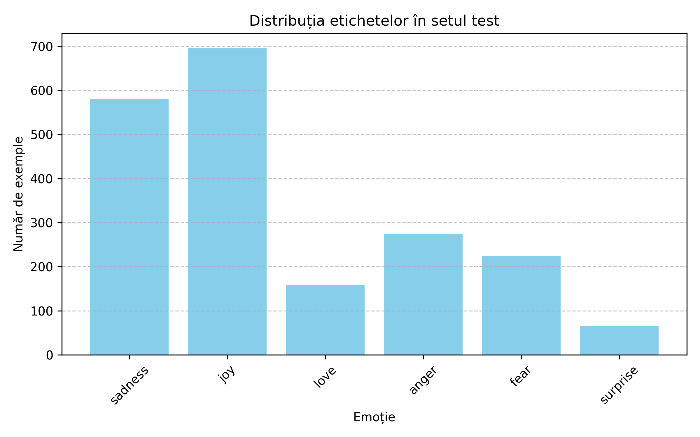
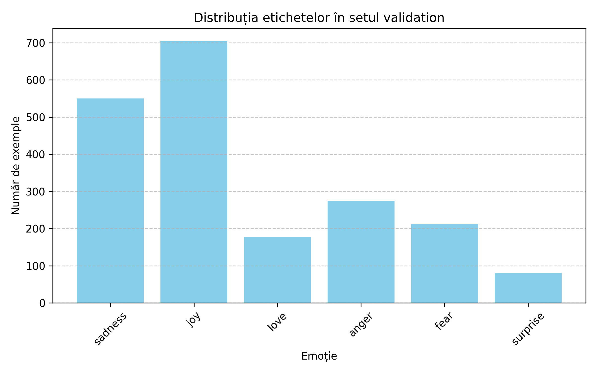

# Detectarea Emoțiilor din Text folosind un  model de NLP

## Descrierea generală a lucrării

### Obiectiv

Construirea unui model simplu de clasificare a emoțiilor pe baza textului introdus de utilizator.

### Tehnologii și tool-uri

1. Python 3.x
2. Pandas
3. scikit-learn
4. Jupyter Notebook (sau Google Colab)

### Set de date:

Folosește setul Emotion Dataset de pe HuggingFace (dair-ai/motion) sau un CSV simplu cu coloanele text și label.

### Pași

- [x] Importul bibliotecilor și citirea datasetului 
- [x] Preprocesarea datelor
- [x] Eliminarea duplicatelor
- [x] Curățarea textului (opțional)
- [x] Vectorizarea textului cu TF-IDF
- [x] Împărțirea în train/test (supervizat și nesupervizat)
- [ ] Antrenarea modelului
- [ ] Evaluarea modelului
- [ ] Interfață simplă de testare (CLI sau Streamlit)

### Exemplu de funcționare

Un mic tool care returnează emoția probabilă asociată unui text (ex: „Mă simt foarte bine azi” -> „joy”).

## Diagramă de flux


## Histograme cu clasele identificate în setul de date

### Train


### Test


### Validation


## Ierarhia de fișiere

```
.
├── Dataset
│   ├── split
│   │   ├── test-00000-of-00001.parquet
│   │   ├── train-00000-of-00001.parquet
│   │   └── validation-00000-of-00001.parquet
│   └── unsplit
│       └── train-00000-of-00001.parquet
├── Diagrama_Flux.svg
├── README.md
├── hist.py
├── main.py
├── out.txt
├── out2.txt
├── plots
│   ├── label_distribution_test.png
│   ├── label_distribution_train.png
│   └── label_distribution_validation.png
├── script.sh
└── venv
```

În folderul Dataset se găsesc fișierele .parquet cu setul de date, test, train și validation.

Fișierul hist.py a fost folosit pentru crearea folderului plots în care se găsesc histograme cu clasele de emoții surprinse în setul de date. Aceste histograme sunt utile pentru a avea o impresie de ansamblu asupra datelor ce urmează a fi prelucrate.

Fișierul main.py conține implementarea efectivă a pașilor prezentați anterior în secțiunea Descrierea generală a lucrării.

Fișierele de tip .txt sunt folosite pentru a salva output-ul din urma rulării fișierului main.py.

Fișierul script.sh are câteva comenzi pentru a șterge fișierele de output și a le crea la loc, pentru a nu exista probleme la suprascriere și rularea fișierului main.py.

## Descrierea funcționalităților implementate

### Citirea Datelor

Citirea datelor a fost efectuată după modelul descris în documentația de pe hugging face.
```
from datasets import load_dataset

train_dataset = load_dataset("Dataset/split", split="train")
valid_dataset = load_dataset("Dataset/split", split="validation")
test_dataset  = load_dataset("Dataset/split", split="test")

df_train = pd.DataFrame(train_dataset)
df_valid = pd.DataFrame(valid_dataset)
df_test = pd.DataFrame(test_dataset)
```

### Prelucrarea Datelor

Prelucrarea Datelor constă în eliminarea duplicatelor, transformarea caracterelor din uppercase in lowercase, eliminarea caracterelor care nu sunt cuvinte sau spații albe.

Eliminarea duplicatelor a fost efectuată folosind funcția `drop_duplicates(keep=first)`.

Transformarea caracterelor din uppercase în lowercase a fost făcută astfel:

`df = df.applymap(lambda x: x.lower() if isinstance(x, str) else x)`

Eliminarea cuvintelor care nu sunt cuvinte sau spații albe:

`df = df.replace(to_replace=r'[^\w\s]', value='', regex=True)`

### Prelucrari asupra textului

Prelucrările făcute asupra textului sunt tokenizarea, ștergerii de stopword-uri și lemmatizarea textului.

Pentru tokenziare am folosit această construcție:

`df['Message'] = df['Message'].apply(word_tokenize)`

Pentru ștergerea de stopwords am procedat astfel:

`stop_words = set(stopwords.words('english'))`

`df['Message'] = df['Message'].apply(lambda x: [word for word in x if word not in stop_words])`


Lemmatizarea constă în ștergerea construcțiilor de tip suffix sau conjugări și a reduce astfel cuvintele la forma lor din dicționar (rădăcină). Această tehnică este des folosită pentru o înțelegere mai profundă a textului și pentru o analiză mai amănunțită a acestuia.

Această secvență de cod prezintă cum am efectuată această operație:

```
lemmatizer = WordNetLemmatizer()

def lemmatize_tokens(tokens):

    def get_wordnet_pos(word):
        tag = nltk.pos_tag([word])[0][1][0].upper()
        tag_dict = {"J": wordnet.ADJ,
                    "N": wordnet.NOUN,
                    "V": wordnet.VERB,
                    "R": wordnet.ADV}
        return tag_dict.get(tag, wordnet.NOUN)
    
    lemmas = [lemmatizer.lemmatize(token, get_wordnet_pos(token)) for token in tokens]
    
    return lemmas
```

O altă operație ce a fost făcută asupra textului a fost concatenarea token-urilor obținute anterior pentru a putea fi aplicată vectorizarea textului cu TF-IDF.

TF-IDF este o metrică statistică folosită în procesarea limbajului natural (NLP) și recuperarea informației pentru a evalua importanța unui cuvânt într-un document relativ la o colecție de documente.

Are rolul de echilibra cuvintele cuvinte și rar folosite pentru a evidenția cei mai relevanți termeni.

**The TF-IDF Formula:**
$$TF-IDF(T, d, D) = TF(t, d) * IDF(t, D)$$

Un scor mai mare arată o mai mare importanță a termenului în cadrul acelui document.

Aceste operații au fost efectuate în cadrul acestei secvențe de cod:

```
df_train['lemmatized_str'] = df_train['lemmatized_text'].apply(lambda tokens: ' '.join(tokens))
df_valid['lemmatized_str'] = df_valid['lemmatized_text'].apply(lambda tokens: ' '.join(tokens))
df_test['lemmatized_str'] = df_test['lemmatized_text'].apply(lambda tokens: ' '.join(tokens))

tfidf = TfidfVectorizer(
    ngram_range=(1, 3),
    min_df=3,             
    max_features=10000
)

X_train_tfidf = tfidf.fit_transform(df_train['lemmatized_str'])
Y_train = df_train['label']

X_valid_tfidf = tfidf.transform(df_valid['lemmatized_str'])
Y_valid = df_valid['label']

X_test_tfidf = tfidf.transform(df_test['lemmatized_str'])
Y_test = df_test['label']
```

Ulterior a fost necesară trecerea seturilor pentru antrenare, testare și validare în foramtul de vectori pentru a putea aplica modelul de antrenare.

### Modelul de Antrenare

Pentru modelul de antrenare am ales regresia logistică cu varianta pentru mai multe clase. 

Regresia logistică are avantajul față de regresia liniară că reușește să distingă mult mai bine clasele între ele. Regresia logistică prezice probabilitatea ca un eveniment să se întâmple în timp ce regresia liniară precize valori numerice continue.

În cazul de față regresia logistică pentru a funcționa pe mai multe clase am folosit funcția softmax pentru a putea transforma rezultatele finale în probabilități pentru a putea apoi face prezicerea clasei din care face parte textul.

Pentru funcția de loss am ales cross-entropy deoarce este mai potrivită pentru clasificare decât funcția de negative log likelihood. Cross-entropy este folosită în acest caz împreună cu softmax și negative log likelihood. 

**Aceasta este formula utilizată:**
$$MCE = -(1/N)*\sum_{i=1}^n*\sum_{j=1}^C*(y_{i,j}*log(p_{i,j}))$$

Funcția cross-entropy poate fi integrată foarte bine cu metode de optimizare cum ar gradient descendent.

Cum am menționat mai sus algoritmul de minimizare este gradient descendent și are forma următoare pentru gradient:

$$\nabla_{\bf w} J({\bf w}) = \frac{1}{N}\sum_{n=1}^{N} (y^{(n)} - t^{(n)}) {\bf x}^{(n)} = \frac{1}{N} {\bf X^T} \cdot ({\bf y - t})$$

**Iar aceasta este procedura utilizată în cod:**

  - intrări:
    - ${\bf w}_{init}$ - ponderi inițializate aleator dintr-o distribuție normala $N(\mu=0, \Sigma=I)$
    - $\alpha$ (rata de învățare)
    - nr\_epoci - numărul de epoci de antrenare
  - ieșiri:
    - ${\bf w^*}$ - ponderi care minimizează funcția de eroare $J({\bf w})$

1. ${\bf w_0}$ = ${\bf w}_{init}$
2. $t$ = 1
3. **cât timp** $t$ < nr\_epoci:
4. &nbsp;&nbsp;&nbsp;&nbsp; ${\bf w}_t \leftarrow {\bf w}_{t-1} - \alpha \nabla_{\bf w} J({\bf w})$
5. &nbsp;&nbsp;&nbsp;&nbsp; $t \leftarrow t+1 $

Față de forma aceasta de bază am introdus și un factor de regularizare pentru a preveni overfitting-ul.

## Tehnologii folosite

| Biblioteca | Descriere | Link documentatie |
| ---------- | --------- | ----------------- |
| scikit-learn | bibliotecă folosită pentru analiză de date, conține metode și obiecte pentru regresie, clustering, reducere dimensională, selecția modelului și preprocesare | [scikit-learn](https://scikit-learn.org/stable/) |
| pandas   | biblioteca ce conține metode, obiecte și implementări pentru structuri de date și analiză de date în python | [pandas](https://pandas.pydata.org/docs/)|
| nltk   | bibliotecă care conține metode, obiecte și implementări pentru procesarea textului scris de oameni pentru a oferi suport în cadrul dezvoltării NLP-urilor | [nltk](https://www.nltk.org/) |
| matplotlib   | bibliotecă cuprinzătoare pentru crearea de vizualizări statice, animate și interactive | [matplotlib](https://matplotlib.org/stable/index.html)|

## Surse

[Hugging Face](https://huggingface.co/datasets/dair-ai/emotion)

[Preprocessing Steps for Natural Language Processing (NLP): A Beginner’s Guide](https://medium.com/@maleeshadesilva21/preprocessing-steps-for-natural-language-processing-nlp-a-beginners-guide-d6d9bf7689c9)

[Geeks for Geeks](https://www.geeksforgeeks.org/understanding-tf-idf-term-frequency-inverse-document-frequency/)

[Scikit-learn documentation](https://scikit-learn.org/stable/)

[Emotion Detection NLP](https://github.com/Nishant2018/Emotion-Detection-NLP-ML-acc-95-/)